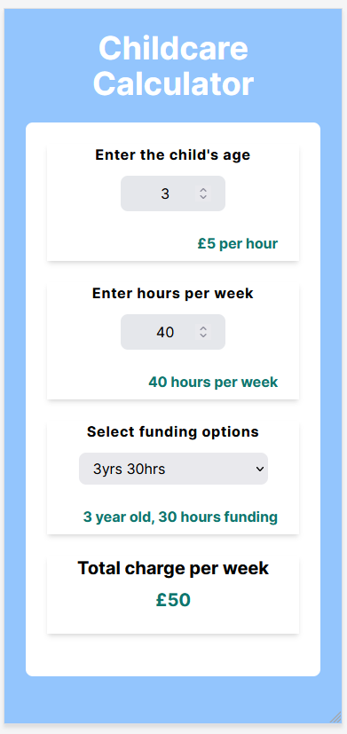

# Childcare Calculator

This is a solution to the [Advice generator app challenge on Frontend Mentor](https://www.frontendmentor.io/challenges/advice-generator-app-QdUG-13db). Frontend Mentor challenges help you improve your coding skills by building realistic projects.

## Table of contents

- [Overview](#overview)
  - [The challenge](#the-challenge)
  - [Screenshot](#screenshot)
  - [Links](#links)
- [My process](#my-process)
  - [Built with](#built-with)
  - [What I learned](#what-i-learned)
  - [Continued development](#continued-development)
  - [Useful resources](#useful-resources)
- [Author](#author)
- [Acknowledgments](#acknowledgments)

## Overview

### The Brief

My childminder once described to me the maths she has to do in order to produce a childcare invoice. I was suprised the council didn't have a calculator to make this easy for their employees, so I decided to make one.

Upon completion, users should be able to:

- Calculate their weekly invoice amount for childcare costs
- Implement the correct funding rates where possible
- Receive a monetary value for the week

### Screenshot

### Links

- Solution URL: (https://github.com/hannahf86/childcare-calculator)
- Live Site URL: (https://magenta-phoenix-cdc886.netlify.app/)

## My process

My goal was to improve my skills with React Hooks and Typescript, so I did not spend a lot of time on the UI until the end.

I first worked out the maths involved and then experimented with a few different methods to gather and display the information in the web app.

I settled on the useEffect, useState and else if methods as I found that this was the cleanest way to deal with the numbers and options the user had.

### Built with

- Semantic HTML5 markup
- CSS custom properties
- Mobile-first workflow
- [React](https://reactjs.org/) - JS library
- [Next.js](https://nextjs.org/) - React Framework
- [Tailwind](https://tailwindcss.com/) - CSS Framework

### What I learned

The goal of this project, from a developer's perspective, was to improve my use of common React Hooks and Typescript, which I now feel more confident in using.

### Continued development

Further development will include the following facilities and features...
- User authentication
- Ability to add multiple children
- Ability to store family information using databases
- The facility to print invoices

## Author

- Website - [Hannah Feehan](https://www.hannahfeehan.com)
- Github - [hannahf86](https://github.com/hannahf86)

## Acknowledgments

Massive thank you to Joe Abell [joseph-abell](https://github.com/joseph-abell) for helping with the logic.
